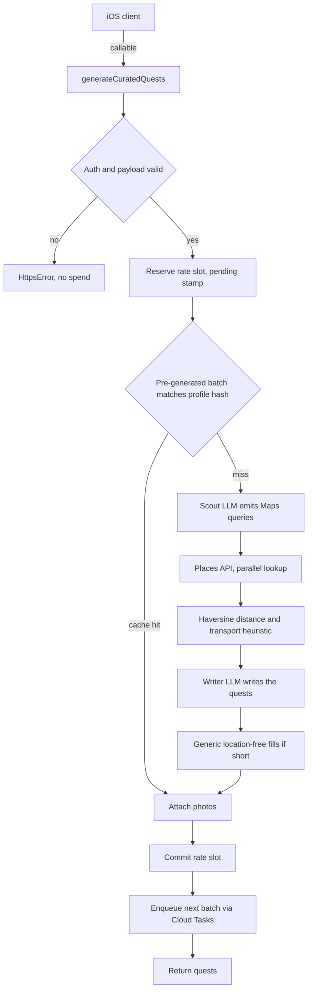

# Horizon

**Turns who you are into real-world quests just past the edge of your comfort zone.**

You tell Horizon what makes you hesitate. It returns a handful of quests at real places
near you — each tied to an actual venue, sized to your budget and travel radius, and
written to push one step past your usual.

🌐 · 📱 iOS, currently in TestFlight beta


`TypeScript` · `Firebase Cloud Functions (gen 2)` · `Node 22` · `React 19` · `Vite` · `Firestore` · `Vercel AI SDK` · `Zod`

---

## What's in this repo

This is the **backend and web** half of Horizon: Cloud Functions, Firestore rules, the
marketing site, and an internal admin dashboard. The SwiftUI iOS client lives in a separate
private repository — nothing here depends on it, and the API contract is documented below.

The interesting problem is that quest generation is **expensive, slow, and unreliable by
nature**: it fans out across LLM providers and the Google Places API, any of which can rate-limit
or fail mid-request. Most of the engineering below is about making that produce something
good, cheaply, every time.

## Architecture

Cloud Functions organised **Controller → Service → Integration**, with two cross-cutting
layers. Controllers only do Firebase things; services take plain arguments and return plain
objects, which is what makes them unit-testable; integrations wrap third-party SDKs so a
vendor swap touches one file.



## Engineering highlights

### Multi-provider LLM routing under free-tier limits

Four providers — Gemini, then Groq, Mistral, Cerebras — behind one router. A Firestore-backed
limiter tracks windows **per model, not per provider** (quotas are metered that way), and orders
candidates by whichever has the most headroom in its scarcest window. On a 429, transient error,
or schema violation it drains that model's window and fails over to the next candidate.

`maxRetries: 0` is deliberate: the SDK's own retry would hammer a model that's already down
before failover could happen.

**It fails open.** If the limiter store is unavailable, routing falls back to static priority
order — bookkeeping problems must never block generation.

→ `functions/src/llm/router.ts`, `rateLimits.ts`, `rateMath.ts`

### Crash-safe two-phase rate limiting

A naive "stamp the user, then generate" limiter burns someone's daily quota when the process
dies mid-request. Instead:

- A **pending stamp** is written in a transaction _before_ any spend, blocking concurrent
  duplicates and retries.
- The **durable stamp** is set only on delivery, so the 24-hour window starts when quests
  actually land.
- Failure clears the pending stamp; a killed process lets it self-expire after 90s.

A dead run costs the user 90 seconds, not a day. The TTL is deliberately kept above the 60s
function timeout so a still-running generation can't be double-entered. The decision logic is
pure and lives in `utils/rateLimit.ts`, which is why it's cheap to test.

### Cache-first generation

After serving a batch, a Cloud Task pre-generates the _next_ one in the background, keyed on a
hash of the user's profile. The common path becomes a Firestore read instead of a multi-second
LLM fan-out. A cached batch is only used if the profile hash still matches, so preference
changes invalidate it correctly.

### Cost as a design constraint

Places calls request **Pro-tier fields only**, keeping every call on the cheaper Text Search SKU
— the venue description that would have required a pricier field is written by the Writer LLM
instead. Combined with pre-generation and `maxInstances` caps, the system runs within free tiers.

### Privacy by construction

The observability corpus carries **no uid**. Profiles sent to LLM providers hold abstract
preferences only — never names, emails, or exact addresses — and coordinates are coarsened to
city level before anything is written. De-identification happens at a single choke point
(`observability/sanitize.ts`) rather than being reimplemented per call site, so it's one file to
audit. Records can't be re-linked to a person, which is also why they can be retained for
model evaluation.

### Partial success over failure

Nothing throws just because one dependency is unhappy. Fewer resolved venues than the target
batch size doesn't fail the request — whatever resolved goes to the Writer, and location-free
quests fill the deficit. A Places outage or a zero-coverage region still returns a usable batch.
Photo attachment is best-effort: a failed fetch omits the image and the client shows a placeholder.

## Frontend and delivery

The marketing site at [usehorizon.app](https://usehorizon.app) is React 19 + Vite + Tailwind v4.

- **354 KB first load** over the wire. Firebase is lazily code-split so the 443 KB SDK chunk
  loads only for `/admin` — a visitor to the marketing page never downloads it.
- **Scroll-scrubbed video showcase**: scroll position drives `currentTime` frame-by-frame.
  This needs dense keyframes to seek smoothly, so clips are encoded with a 3-frame keyframe
  interval — 0.125s seek granularity — and tuned against text legibility rather than by
  bitrate alone. Posters are held over each clip until it's buffered, so a cold visitor sees a
  still frame instead of a blank one.
- **Cookieless analytics.** A `sendBeacon` call to a Cloud Function increments per-day counters.
  No identifier, no IP, no per-visitor row — a visit is indistinguishable from any other, so it
  needs no consent banner. Deliberately not Firebase Analytics, which would have pulled the
  Firebase SDK back into the marketing bundle.
- **Admin dashboard** for the generation pipeline: outcome breakdowns, stage latency, and
  traffic, on a colour palette validated for colour-vision deficiency.

## Repo layout

```text
functions/          Cloud Functions (gen 2, Node 22)
  controllers/      Firebase entrypoints — validation and error mapping only
  services/         business logic, framework-free and unit-testable
  integrations/     Places API, Firestore
  llm/              provider registry, rate-aware router, Zod schemas
  observability/    AsyncLocalStorage tracer, de-identification
hosting/            React 19 + Vite — marketing site and admin dashboard
firestore/          security rules and indexes
docs/               architecture, API contract, runbooks
```

## Testing

|          |                                                                             |
| -------- | --------------------------------------------------------------------------- |
| Backend  | **116 tests** across 14 files                                               |
| Frontend | **17 tests**                                                                |
| Types    | `strict` TypeScript on both halves, `noUnusedLocals` / `noUnusedParameters` |

The layering is what makes this testable: rate-limit decisions, distance math, prompt
construction, schema validation, and router failover are all pure functions, so they're covered
without mocking Firebase.

```bash
cd functions && npx jest        # backend
cd hosting  && npm test         # frontend
npm run build                   # typecheck + production build
```

## Docs

|                                                            |                                                                 |
| ---------------------------------------------------------- | --------------------------------------------------------------- |
| [docs/agent/architecture.md](docs/agent/architecture.md)   | Request flows, rate limiting, routing, cost and privacy posture |
| [docs/api/api-contracts.md](docs/api/api-contracts.md)     | Wire contract between the iOS app and backend                   |
| [docs/agent/observability.md](docs/agent/observability.md) | Tracing model and the sample corpus                             |
| [docs/developer/](docs/developer/)                         | Commands, secrets, launch checklist                             |
